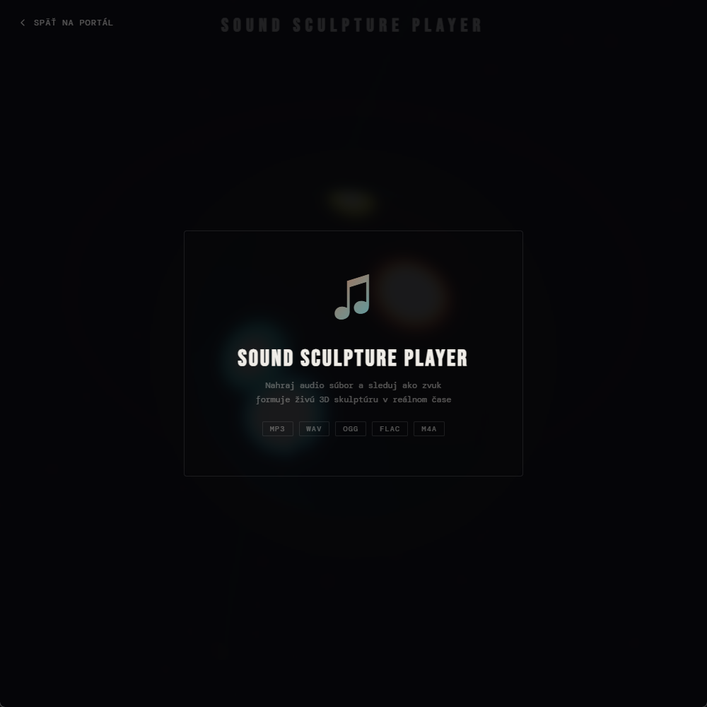
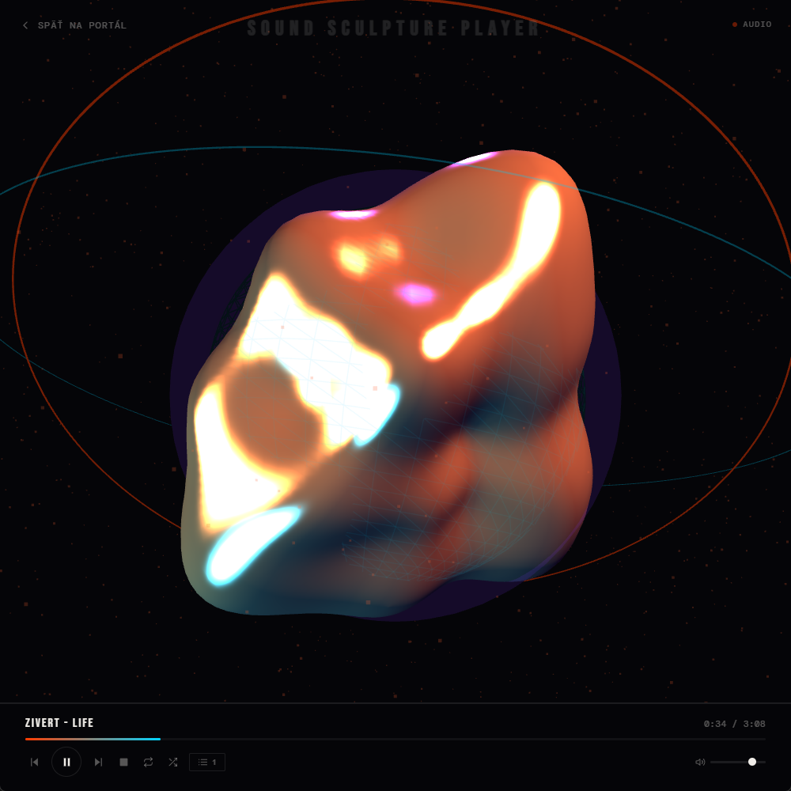
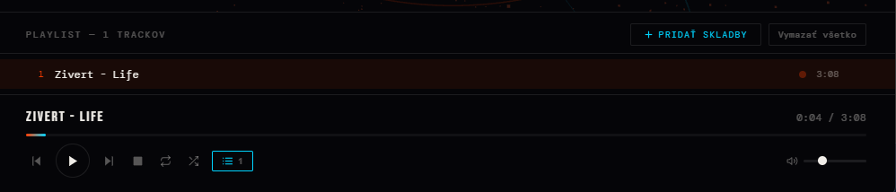

# 🎵 Sound Sculpture Player

An interactive 3D audio visualizer with a full-featured music player. Drop any track and watch a living 3D sculpture respond to every beat, bass hit, and frequency shift — in real time, right in your browser.

## 🖼️ Preview







## ✨ Features

### Player
- **Playlist** — load multiple tracks at once, manage your queue on the fly
- **Full player controls** — play, pause, stop, previous, next
- **Loop & Shuffle** — repeat a single track or go full random
- **Seekbar** — click anywhere on the progress bar to jump to that moment
- **Volume control** — smooth slider with instant response
- **Drag & drop** — drop audio files directly onto the page
- **Mute toggle** — instant mute/unmute with volume memory

### Visualizations
12 real-time 3D visualizations, switchable on the fly via the **Vizualizácia** button:

| # | Name | Description |
|---|------|-------------|
| 1 | **Skulptúra** | Deformable sphere — the original. Bass warps the geometry, mids control the wireframe, highs drive particles |
| 2 | **Vlnenie** | 3D wave ocean — a grid mesh that ripples by frequency column, camera orbits above |
| 3 | **Galaxia** | Spiral galaxy of 7 000 particles in 3 arms with differential rotation (inner orbits faster than outer) |
| 4 | **Oscilátor** | CRT oscilloscope — raw time-domain waveform, color shifts orange↔cyan with bass |
| 5 | **Spektrum** | 128 radial frequency bars arranged in a circle, smoothly scaled per-bar |
| 6 | **DNA** | 90-node double helix with per-node amplitude; rungs glow with mids |
| 7 | **Tunel** | Neon speed tunnel — 36 rings with continuous fly-through, bass controls speed |
| 8 | **Aurora** | Northern lights ribbon — wide mesh with per-column vertex colors driven by frequencies |
| 9 | **Kryštál** | Icosahedron crystal with bass-driven vertex deformation and glowing wireframe overlay |
| 10 | **Lúče** | 80 radial light beams rotating and scaling by frequency band |
| 11 | **Prach** | 6 000-particle nebula disc with orbital motion; bass triggers an outward explosion |
| 12 | **Prizma** | 5 gyroscopic torus rings at different tilts, each band-reactive, with a pulsing inner core |

All visualizations use smoothed audio values (lerp) so there is no jitter — every transition is fluid.

### Keyboard Shortcuts
A `?` button appears in the bottom-right corner after loading a track. All shortcuts work globally.

#### Playback
| Key | Action |
|-----|--------|
| `Space` | Play / Pause |
| `S` | Stop |
| `←` or `A` | Previous track |
| `→` or `D` | Next track |
| `Shift + ←` | Seek back 5 seconds |
| `Shift + →` | Seek forward 5 seconds |

#### Volume
| Key | Action |
|-----|--------|
| `↑` | Volume +5% |
| `↓` | Volume −5% |
| `M` | Mute / Unmute (remembers previous level) |

#### Modes & UI
| Key | Action |
|-----|--------|
| `L` | Toggle Loop |
| `R` | Toggle Shuffle |
| `P` | Open / close Playlist panel |
| `V` | Open / close Visualization picker |
| `Tab` | Cycle to next visualization |
| `?` | Open / close keyboard shortcuts help |

## 🚀 How to use

1. Open `index.html` in your browser
2. Drag & drop audio files or click to select them (MP3, WAV, OGG, FLAC, M4A)
3. The visualization starts reacting to the music immediately
4. Switch between 12 visualizations with the **Vizualizácia** button or press `Tab`
5. Add more tracks anytime via the playlist panel (`P`)
6. Press `?` for the full list of keyboard shortcuts

## 🔬 How it works

The app uses the **Web Audio API** to run a real-time FFT analysis on the audio stream. The frequency data is split into three bands:

- **Bass (0–8%)** — drives geometry deformation, particle expansion, tunnel speed, and beat flashes
- **Mids (8–35%)** — controls ring rotation, wireframe opacity, DNA glow, aurora ribbon flow
- **Highs (35–100%)** — affects particle opacity, beam lengths, crystal wireframe brightness

All smoothed values use a per-frame lerp (`sB`, `sM`, `sH`, `sV`) with additional per-element smoothed arrays for bar-level visualizations, eliminating jitter entirely.

All rendering is done via **Three.js** using WebGL — no canvas 2D, no SVG.

## 🛠️ Built with

- [Three.js r128](https://threejs.org/) — 3D rendering via WebGL
- [Web Audio API](https://developer.mozilla.org/en-US/docs/Web/API/Web_Audio_API) — real-time FFT and time-domain analysis
- Vanilla JavaScript — player engine, playlist logic, keyboard shortcuts, UI
- HTML5 / CSS3 — layout and styling

> 100% client-side. No backend, no dependencies to install. Works fully offline.

## 📁 Files

```
sound-sculpture-player/
├── index.html       ← entire app, self-contained
├── thumbnail.png    ← upload screen
├── thumbnail2.png   ← active player
├── thumbnail3.png   ← playlist view
└── README.md
```